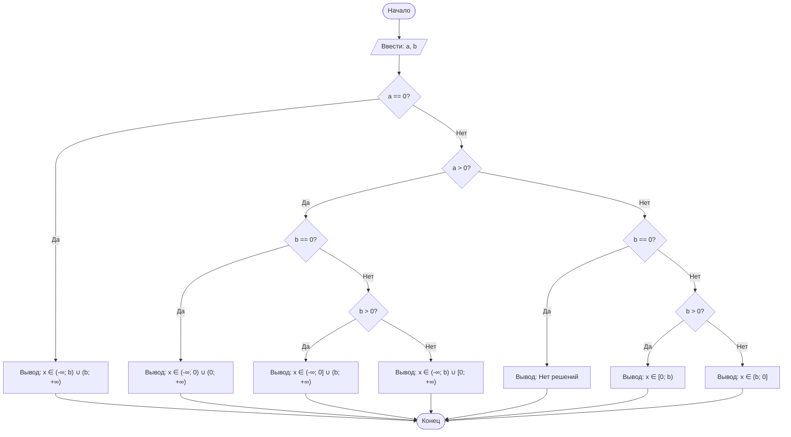

## Отчет по лабораторной работе № 1

#### № группы: `ПМ-2602`

#### Выполнил: `Капустин Александр Владимирович`

#### Вариант: `8`

### Содержание:

- [Постановка задачи](#1-постановка-задачи)
- [Входные и выходные данные](#2-входные-и-выходные-данные)
- [Выбор структуры данных](#3-выбор-структуры-данных)
- [Алгоритм](#4-алгоритм)
- [Программа](#5-программа)
- [Анализ правильности решения](#6-анализ-правильности-решения)

### 1. Постановка задачи

> Программа получает на вход два вещественных числа a и b. Нужно вывести множество решений неравенства
> `a * x / (x - b) >= 0`, где x - переменная. Деление на ноль не допускается, поэтому x ≠ b.

Данную задачу можно разделить на 3 основных случая по коэффициенту a: a = 0, a > 0, a < 0.
В случаях a > 0 и a < 0 нужно дополнительно рассмотреть положение b относительно нуля: b = 0, b > 0, b < 0.
Всего получается 1 + 3 + 3 = 7 случаев.

### 2. Входные и выходные данные

#### Данные на вход

|             | Тип                |
|-------------|--------------------|
| a           | Вещественное число |
| b           | Вещественное число |

#### Данные на выход

|                   | Тип    | Описание                                             |
|-------------------|--------|------------------------------------------------------|
| Множество решений | Строка | Интервал(-ы) с решениями или сообщение "Нет решений" |

### 3. Выбор структуры данных

|             | название переменной | Тип (в Java) |
|-------------|---------------------|--------------|
| a           | `a`                 | `double`     |
| b           | `b`                 | `double`     |

Для ввода используется `Scanner`. Для вывода используется `System.out`. Результат не хранится в отдельной переменной, а сразу выводится.

### 4. Алгоритм

#### Алгоритм выполнения программы:

1. **Ввод данных:**  
   Программа считывает два вещественных числа `a` и `b`.

2. **Проверка `a == 0`:**  
   Если `a` равно 0, выводится `x ∈ (-∞; b) ∪ (b; +∞)`.

3. **Проверка `a > 0`:**  
   Если `a` больше 0:
   - при `b == 0` выводится `x ∈ (-∞; 0) ∪ (0; +∞)`;
   - при `b > 0` выводится `x ∈ (-∞; 0] ∪ (b; +∞)`;
   - при `b < 0` выводится `x ∈ (-∞; b) ∪ [0; +∞)`.

4. **Случай `a < 0`:**  
   Если `a` меньше 0:
   - при `b == 0` выводится `Нет решений`;
   - при `b > 0` выводится `x ∈ [0; b)`;
   - при `b < 0` выводится `x ∈ (b; 0]`.

5. **Вывод результата:**  
   На экран выводится строка с множеством решений.

#### Блок-схема



### 5. Программа

```java
import java.util.Scanner;

public class Main{
    public static void main(String[] args){
        Scanner x = new Scanner(System.in);

        System.out.print("a = ");
        double a = x.nextDouble();
        System.out.print("b = ");
        double b = x.nextDouble();

        if (a == 0) {
            System.out.println("x ∈ (-∞; " + b + ") ∪ (" + b + "; +∞)");
        } else if (a > 0) {
            if (b == 0) {
                System.out.println("x ∈ (-∞; 0) ∪ (0; +∞)");
            } else if (b > 0) {
                System.out.println("x ∈ (-∞; 0] ∪ (" + b + "; +∞)");
            } else {
                System.out.println("x ∈ (-∞; " + b + ") ∪ [0; +∞)");
            }
        } else { // a < 0
            if (b == 0) {
                System.out.println("Нет решений");
            } else if (b > 0) {
                System.out.println("x ∈ [0; " + b + ")");
            } else {
                System.out.println("x ∈ (" + b + "; 0]");
            }
        }

    }

}
```

### 6. Анализ правильности решения

Программа работает корректно на всем множестве решений.

1. Тест на `a == 0, b любое вещественное число`:

    - **Input**:
        ```
        0 -564
        ```

    - **Output**:
        ```
        x ∈ (-∞; -564.0) ∪ (-564.0; +∞)
        ```

2. Тест на `a > 0, b == 0`:

    - **Input**:
        ```
        7 0
        ```

    - **Output**:
        ```
        x ∈ (-∞; 0) ∪ (0; +∞)
        ```

3. Тест на `a > 0, b > 0`:

    - **Input**:
        ```
        7 24
        ```

    - **Output**:
        ```
        x ∈ (-∞; 0] ∪ (24.0; +∞)
        ```

4. Тест на `a > 0, b < 0`:

    - **Input**:
        ```
        4 -3
        ```

    - **Output**:
        ```
        x ∈ (-∞; -3.0) ∪ [0; +∞)
        ```

5. Тест на `a < 0, b == 0`:

    - **Input**:
        ```
        -4 0
        ```

    - **Output**:
        ```
        Нет решений
        ```

 6. Тест на `a < 0, b > 0`:

    - **Input**:
        ```
        -2 10
        ```

    - **Output**:
        ```
        x ∈ [0; 10.0)
        ```

 7. Тест на `a < 0, b < 0`:

    - **Input**:
        ```
        -2 -86
        ```

    - **Output**:
        ```
        x ∈ (-86.0; 0]
        ```
